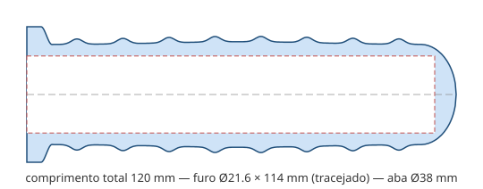

# Manopla esquerda — Yamaha Neo 115 (2008) — Impressão 3D

Projeto de manopla **esquerda** (lado sem acelerador) para a Yamaha Neo 115 ano 2008,
que usa guidão padrão de **7/8" (22,2 mm)**.



## Arquivos

| Arquivo | Descrição |
|---|---|
| `stl/manopla_esquerda_neo2008.stl` | Modelo pronto para fatiar (malha estanque, verificada) |
| `scad/manopla_esquerda_neo2008.scad` | Fonte paramétrica em OpenSCAD (edite e exporte seu STL) |
| `scripts/gerar_stl.py` | Gerador do STL em Python puro (sem dependências) |
| `scripts/gerar_perfil_svg.py` | Gera o desenho de perfil da documentação |

## Dimensões

- **Comprimento total:** 120 mm
- **Furo interno:** Ø21,6 mm × 114 mm de profundidade (interferência de 0,6 mm
  no diâmetro para fixação firme no tubo de 22,2 mm — pensado para TPU)
- **Corpo:** Ø28 mm base, com 8 anéis de pega (até ~Ø31) e leve
  engrossamento ergonômico no centro
- **Aba (flange):** Ø38 mm junto ao punho, protege a mão e encosta no manete
- **Ponta:** fechada e arredondada (parede de ~6 mm no fundo)

## Material e impressão

**Material recomendado: TPU 95A (flexível).** É o único material que dá
pegada, conforto e durabilidade de manopla de verdade. PLA/PETG ficam
rígidos e escorregadios — use apenas como peça de emergência.

Configurações sugeridas (TPU 95A):

- **Orientação:** em pé, com a boca (lado da aba) na mesa — **sem suporte**
- **Altura de camada:** 0,2 mm
- **Perímetros:** 3 a 4 (importante para resistência da parede)
- **Preenchimento:** 20–30 % (giroide)
- **Velocidade:** 20–30 mm/s (TPU não gosta de pressa)
- **Retração:** mínima ou desligada (extrusor direto ajuda muito)
- **Temperatura:** 220–235 °C bico / 40–50 °C mesa (siga o fabricante do filamento)

## Instalação

1. Remova a manopla velha (ar comprimido ou chave de fenda + álcool ajudam).
2. Limpe bem o tubo do guidão — sem graxa ou resíduo de cola.
3. O furo tem aperto proposital: borrife **álcool isopropílico** dentro da
   manopla e empurre-a girando; ao evaporar, ela trava. Para fixação
   definitiva, use **cola de manopla** própria.
4. Aguarde algumas horas antes de usar a moto.

⚠️ **Segurança:** manopla é item de segurança. Verifique se ficou firme
(sem girar no tubo) antes de rodar, e inspecione periodicamente. Peça
impressa em 3D é solução de reposição/emergência; a manopla original
continua sendo a referência.

## Personalização

Todos os parâmetros (diâmetro do guidão, aperto, comprimento, número e
altura das nervuras, tamanho da aba, etc.) estão no topo de
`scripts/gerar_stl.py` e de `scad/manopla_esquerda_neo2008.scad` — os dois
geram a mesma geometria. Para regenerar o STL:

```bash
python3 scripts/gerar_stl.py stl/manopla_esquerda_neo2008.stl
```

O script confere automaticamente se a malha é estanque (manifold) antes de gravar.

Exemplos de ajuste:

- **Ficou apertada demais na sua impressora?** Aumente `FOLGA_DIAMETRAL`
  para `-0.4` ou `-0.2` (a calibração de cada impressora influencia muito).
- **Quer usar em outra moto com guidão de 1"?** Mude `DIAM_GUIDAO` para `25.4`.
- **Pegada mais agressiva?** Aumente `NERV_ALTURA` para `2.0`.
